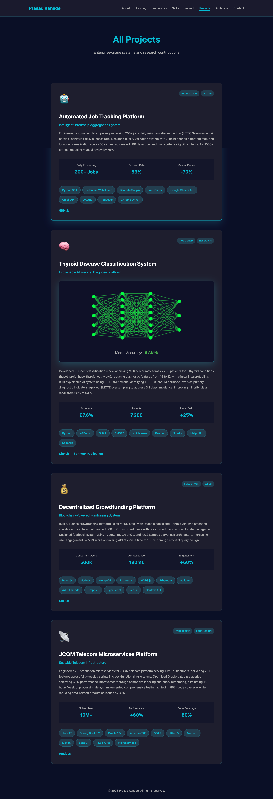
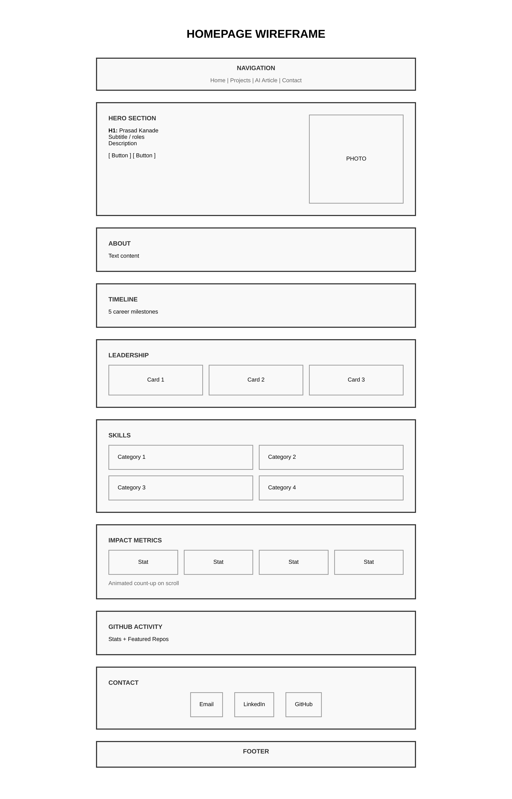
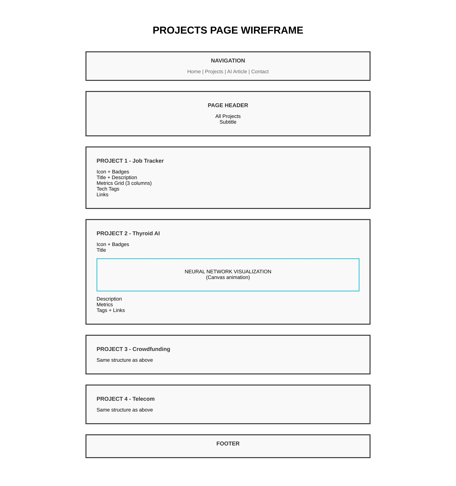
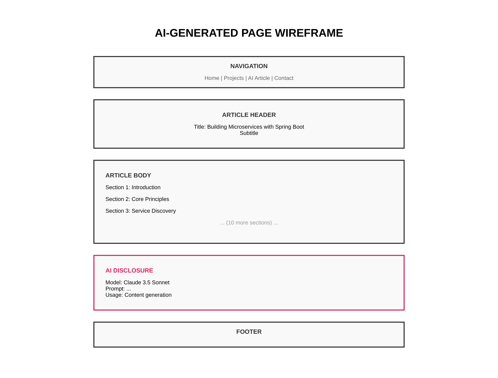

# Prasad Kanade Portfolio

**Author**: Prasad Kanade  
**Course**: CS 5610 Web Development - Spring 2026  
**Institution**: Northeastern University  
**Class Link**: https://northeastern.instructure.com/courses/245751  
**Deployed Site**: https://prasad0411.github.io/Prasad-Portfolio/

**Demo Link**: https://northeastern.hosted.panopto.com/Panopto/Pages/Viewer.aspx?id=bb3caaeb-de0e-4a6b-8b64-b3de0153088e

**Presentation**: https://docs.google.com/presentation/d/18KcJzm2gpB7OPhEhwHI4OUNMRl6DSuv8b5fxc7dkCqc/edit?usp=sharing

## Project Objective

A professional portfolio website showcasing software engineering experience, AI/ML research, and technical projects. Built with vanilla HTML5, CSS3, and ES6+ JavaScript featuring interactive Matrix rain background and neural network visualization to demonstrate advanced frontend development skills.

## Screenshots

### Homepage


### Projects Page



### AI Generated Article


### Design Wireframes







## Features

- Matrix Rain Background: Canvas-based falling code animation with mouse interaction
- Neural Network Visualization: Animated AI training process on projects page
- Scroll Animations: Progressive content reveal using Intersection Observer
- Interactive Skills: Animated progress bars showing technical proficiency
- Stats Counter: Count-up animation for impact metrics
- Email Copy: One-click email copy-to-clipboard functionality
- Professional Timeline: Visual career progression with hover effects
- Responsive Design: Mobile-friendly layout with grid and flexbox

## Technologies Used

- HTML5 with semantic markup
- CSS3 with Grid, Flexbox, animations, and custom properties
- JavaScript ES6+ with modules, Canvas API, and Intersection Observer
- Git and GitHub for version control
- GitHub Pages for deployment

## Installation and Setup

### Prerequisites

- Node.js version 14 or higher
- Git

### Local Development

```bash
# Clone repository
git clone https://github.com/prasad0411/prasad-portfolio.git
cd prasad-portfolio

# Install dependencies
npm install

# Format code
npm run format

# Lint code
npm run lint

# Start local server
python3 -m http.server 8000

# Open browser at http://localhost:8000
```

## Creative Components

### Matrix Rain Background

- Canvas-based animation using vanilla JavaScript
- Real code characters from SQL, Java, and Python
- Mouse interaction - code parts away from cursor
- Runs continuously at 30fps
- No external libraries required

### Neural Network Visualization

- Canvas rendering of 5-8-8-3 neural network architecture
- Progressive node and connection activation
- Real-time accuracy counter from 0% to 97.6%
- Loads on scroll using Intersection Observer
- Represents Thyroid Disease Classification research project

### Scroll-Based Animations

- Timeline items fade in sequentially with staggered delays
- Leadership cards reveal on viewport entry
- Skill bars animate progressively on scroll
- Stats counter triggers when visible
- Smooth, performant animations throughout

## GenAI Usage Disclosure

### Claude 3.5 Sonnet (Anthropic) - January 25, 2026

**1. AI-Generated Blog Post**

- File: ai-generated.html
- Prompt: "Write a comprehensive technical article about building microservices with Spring Boot, covering architecture patterns, service discovery, API gateways, communication strategies, security, and deployment."
- Usage: 100% AI-generated content with human review for technical accuracy
- Disclosed: Prominent AI disclosure section included on the page

**2. Code Structure Assistance**

- Prompts: "Help optimize CSS animations", "Debug Canvas API rendering issues", "Improve code organization"
- Usage: Code suggestions, bug fixes, optimization recommendations
- Implementation: Human-written code with AI guidance for best practices

**3. Design Documentation**

- Prompts: "Help structure design document with user personas and user stories", "Format professional README"
- Usage: Documentation framework and content organization
- Implementation: Customized for specific project requirements

**4. Content Review**

- Prompts: "Review professional experience descriptions for clarity"
- Usage: Content refinement and clarity improvements
- Implementation: All personal content written by human, reviewed with AI assistance

## Contact

**Prasad Kanade**  
Email: kanade.pra@northeastern.edu  
LinkedIn: https://www.linkedin.com/in/prasad-kanade-/  
GitHub: https://github.com/prasad0411

## License

This project is licensed under the MIT License. See the LICENSE file for details.
